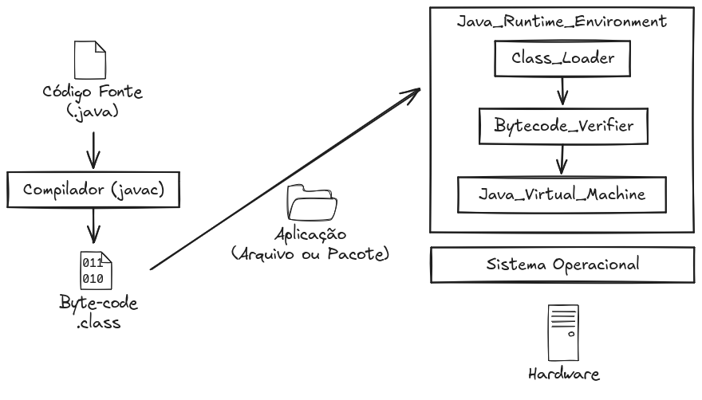

<!-- 
_class: lead
-->

# Aula 03 - Introdução ao Java

---

<!--
paginate: true
class: normal
-->

## Plataforma Java


* Criada em 1995
* Desenvolvida pela *Sun Microsystems* até 2010
* Propriedade da *Oracle Corporation*
* Conjunto de softwares e padrões
    * Linguagem
    * Kits de desenvolvimento
    * Máquina Virtual

---



---

## Linguagem Java


* Criada por James Gosling (1991)
* Baseada em classes
* Orientada a Objetos
* Compilada para byte-code usando JAVAC

---

### Linguagem Tipada

Variáveis devem ser declaradas com o tipo de dado que será armazenado. Tipos de dados podem ser primitivos (`int`, `float`, `bool`) ou objetos (`String`, `Pessoa`).

````java
int idade = 20;
String nome = "Ramon";
````

---

### Exemplo de Classe

Uma classe estabelece um modelo de dados que pode conter propriedades e métodos. Métodos são como funções, mas possuem contexto diferenciado.

````java
public class Pessoa {
    public String nome;
    public int idade;

    public void andar() {
        Mundo.mover(this, 10, 0);
    }

    public void falar(String texto) {
        System.out.println(texto);
    }
}
````

---

### Instanciando uma Classe

Quando criamos um dado a partir de um modelo (a classe), damos o nome de objeto. Um objeto pode definir valores para suas propriedades e executar que levam em consideração o contexto do objeto.

````java
Pessoa pessoa = new Pessoa();
pessoa.nome = "Ramon";
pessoa.andar();
````

---

## Java Virtual Machine (JVM)


* Código fonte aberto em 2007
* Roda programas compilados
* Ambiente completo é chamado de Java Runtime Environment
    * Inclui bibliotecas e a JVM
* Especificação com várias implementações
    * Hotspot
    * GraalVM

---

## Java Development Kit (JDK)


* Compilador, JVM, Debuggers, Docs, Base Packages

---

## Gerenciamento de Memoria

* Garbage Collector deleta memória não **referenciada**
* Processo automático
* Libera o programador de alocar e desalocar recursos da memória

```java
Object meuObjeto = new Object(); // novo objeto é alocado na memoria
meuObjeto = null; // Objeto desalocado da memória e aguarda deleção
```

Como seria na linguagem `C++`: 
```c
int *ptr; // Inicia um ponteiro
ptr = (int*) malloc(sizeof(int)); // aloca um ponteiro de memória do tamanho de um inteiro
free(ptr1); // libera area de memória
```

---

## Tipos de dados (Datatypes)

* Primitivos
    * `byte`, `short`, `int`, `long`, `float`, `double`, `boolean` e `char`
* Não-primitivos
    * `Object`

---

### Uso de memória

|tipo| estimativa | capacidade |
|-|-| - |
| `byte` | 1 byte | 2⁸ = 256 |
| `short` | 2 bytes | 2¹⁶ = 65536 |
| `int` | 4 bytes | 2³² = ~ 4bilhões |
| `float` | 4 bytes | 2³² = ~ 4bilhões |
| `double` | 8 bytes | 2⁶⁴ |
| `Object` | pelo menos 16 bytes (12 bytes para cabeçalho) | `Java Heap Size` |

> Variáveis que armazenam referências possuem geralmente 4 bytes
> O tamanho de cada tipo de dados é dependente de plataforma

---

## Sintaxe

* Declarações
* Métodos
* Booleanos
* Strings
* Arrays
* Console
* Estruturas de Decisão e Repetição
* Imports e Packages

---

### Declarações

Declarações de variáveis são realizadas de maneira **tipada** (quando é necessário informar que tipo de dado vamos armazenar em uma variável)

Para declarações de variáveis dentro de classes, podemos utilizar também o modificador de acesso (`public`, `protected`, `private`). À essas variáveis damos o nome de **Atributos**.

````java
public int numero;
public String nome;
protected boolean estaChovendo;
private String[] chamada;
````

---

### Métodos

Métodos, que são como funções em outras linguagens, também possuem modificadores de acesso

````java
public void imprimir() {

}

public String retornaNome(String nome) {
    return nome;
}

public int calcula(int a, int b) {
    return a + b;
}
````

---

### Booleanos

Representa tipos de dados que só podem assumir dois valores (`true` e `false`). Tipicamente ocupa um byte de memória.

````java
boolean estaChovendo = true;
boolean vaiChover = estaChovendo || (probabilidadeChuva > 90);
````

Utiliza-se de operadores de comparação (como `>`, `<` e `=`) operadores booleanos:
* `||` - OU
* `&&` - E
* `!` - NEGAÇÃO

---

### Strings

Strings são sequencias de caracteres utilizados para representar texto. São representadas pelas `"` (Aspas duplas) e podem ser concatenadas (unidas) usando o operador `+` (soma).

````java
String nome = "Wesley"
String sobrenome = "Safadão"
String artista = nome + " " + sobrenome;
````

Strings são imutáveis, significando que após geradas não serão modificadas.

---

#### Métodos de Strings

Assumindo que acabamos de criar uma nova string chamada `texto`, podemos utilizar os seguntes métodos:

* `texto.length` - retorna o tamanho do texto
* `texto.equals("teste")` - compara se o conteúdo de texto é igual a `teste`
* `texto.toLowerCase()` - retorna o conteúdo de texto em caixa baixa
* `texto.toUpperCase()` - retorna o conteúdo de texto em caixa alta
* `texto.replace("a", "b")` - substitui todos os caracteres `a` por `b`
* `texto.split("x")` - quebra a string em várias strings usando a letra `x`

---

### Arrays

Arrays são estruturas capazes de armazenar múltiplos valores de um mesmo tipo sob uma mesma variável de referência.

```java
// declara um novo vetor com 6 números inteiros
int[] numerosMegaSena = new int[6];
// numerosMegaSena ==> int[6] { 0, 0, 0, 0, 0, 0 }
```

Arrays em java possuem tamanho fixo definitivo ao serem instanciados. A primeira posição de um vetor sempre será 0.

```java
numerosMegaSena[0]; // acessa a primeira posição do vetor anterior
numerosMegaSena[5]; // acessa a última posição do vetor anterior
numerosMegaSena[6]; // indexOutOfBounds - fora de posição
```

---

Também podemos utilizar as chaves para gerar um novo vetor com valores pré-definidos:

```java
int[] numerosMegaSena = {4, 11, 19, 25, 33, 42};
```

Vetores de qualquer tipo de dado podem ser gerados, incluindo os não primitivos:

```java
Object[] dados = {"matrix", 10, true};
```

> Os valores acima são respectivamente String, Integer e Boolean, que são, por definição, todos herdeiros da classe Object.

---

## Percorrendo vetores

````java
String[] linhas = {"Içara", "Maracajá", "Araranguá", "Cocal do Sul"};
````

````java
for (int i = 0; i < linhas.length; i++) {
    System.out.println(linhas[i]);
}
````

ou

````java
for (String l : linhas) {
  System.out.println(l);
}
````

---

#### Métodos de Arrays

Assumindo que acabamos de criar um novo array chamado chamado `lista`, podemos utilizar os seguntes métodos:

* `lista.length` - retorna o tamanho do vetor
* `lista.equals(lista2)` - compara se o vetor `lista` é igual ao vetor `lista2`. Vetores são iguais se possuem mesmo tamanho, valores iguais e na mesma ordem.
* `Arrays.toString(lista)` - imprime o conteúdo do vetor em forma de texto
* `Arrays.fill(dados, 1)` - preenche todos as posições do vetor com o valor
* `Arrays.sort(dados)` - Ordena o vetor por ordem numerica ou lexicográfica

---

### Console

Para imprimir no console:

````java
System.out.println("Hello World!");
````

Para ler dados do console, especialmente do que é digitado pelo usuário:

````java
Scanner scanner = new Scanner(System.in);
String nome = scanner.nextLine();
````

---

### Estrutura de Decisão


Estruturas de decisão são responsáveis por definir o fluxo de execução de um código. Essas decisões geralmente criam diferentes rotas para aplicação e devem ser pensados com cuidado pois aumentam o número de testes necessários para um código ([test covering](https://pt.wikipedia.org/wiki/Cobertura_de_c%C3%B3digo))

---

#### IF-ELSE

Utilizado para definir o fluxo do código. Testes booleanos (``true`` ou ``false``) são usados como condição para executar ou não um bloco de código.

````java
if (condicaoBooleana) {
    executeIssoSeVerdadeiro()
}
````

````java
if (condicaoBooleana) {
    executeIssoSeVerdadeiro()
} else {
    executeIssoSeFalso()
}
````

---

#### Operador Ternario

Tem como objetivo retornar um valor a partir de uma condicional, em uma única operação;

````java
int valorFinal = if (condicaoBooleana) ? valorSeVerdadeiro : valorSeFalso;
````

---

### Estrutura de Repetição


Estruturas de repetição permitem executar blocos de código diversas vezes, geralmente com parâmetros diferentes à cada iteração.

As duas principais estruturas que utilizamos (em diversas linguagens) são:

* for
* while

---

#### for tradicional

Usado geralmente para iterar sobre uma quantidade definida de operações. É composto por declaração, condição booleana e uma operação pós-loop, porém todos os valores são opcionais.

````java
int quantidadeDeIteracoes = 5;
for (int i = 0; i < quantidadeDeIteracoes; i++) {
    // faça isso
}
````

---

#### for-each

Usado para iterar sobre coleções iteráveis (especialmente vetores).

````java
String[] cidades = {"içara", "forquilhinha", "maracajá"};
for (String c : cidades) {
    System.out.println(c);
}
````

---

#### while

Usado geralmente para iterar quando a condição booleana deve ser manipulada de dentro do loop. Similar ao for-loop tradicional.

````java
while(condicaoBooleana) {
    // repete enquanto a condição booleana for verdadeira
}
````

---

## Imports e Packages

Packages são usados no Java para organizar diferentes conjuntos de classes. Cada classe possui seu package definido logo no início do documento.

````java
// package [nome_do_pacote]
package com.organizacao.modelos;
````

---

Para referenciar uma classe ou um conjunto delas (packages), é preciso declarar suas importações diretamente no arquivo onde serão utilizadas.

````java
// import [nome_do_pacote]
import com.organizacao.modelos.Pessoa;
import com.organizacao.servicos.*;
// ...

public static void main(String[] args) {
    Pessoa pessoa = new Pessoa();
}
````

---

Sem a declaração de `import` é necessário especificar o caminho completo do package de uma classe.

````java
// sem imports
// ...

public static void main(String[] args) {
    com.organizacao.modelos.Pessoa pessoa = new com.organizacao.modelos.Pessoa();
}
````

Porque usar packages?

* Encapsula um conjunto de classes
* Evita conflitos de nome e garantem encapsulamento e proteção

---

## O que aprendemos hoje

* O que é a plataforma Java e seus componentes
* A sintaxe básica para a linguagem java
* Estruturas da linguagem e seu funcionamento