<!-- 
_class: lead
-->

# Aula 00: Introdução à Disciplina

---

<!--
paginate: true 
class: normal
-->

## Apresentação do Professor
### Ramon Venson

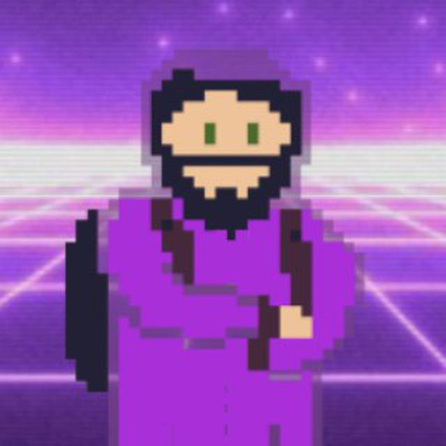

* Bacharel em Ciência da Computação
* Especialização em Tecnologias Web
* Mestrado em Tecnologia da Informação e Comunicação
* Professor e Desenvolvedor

---

### Interesses

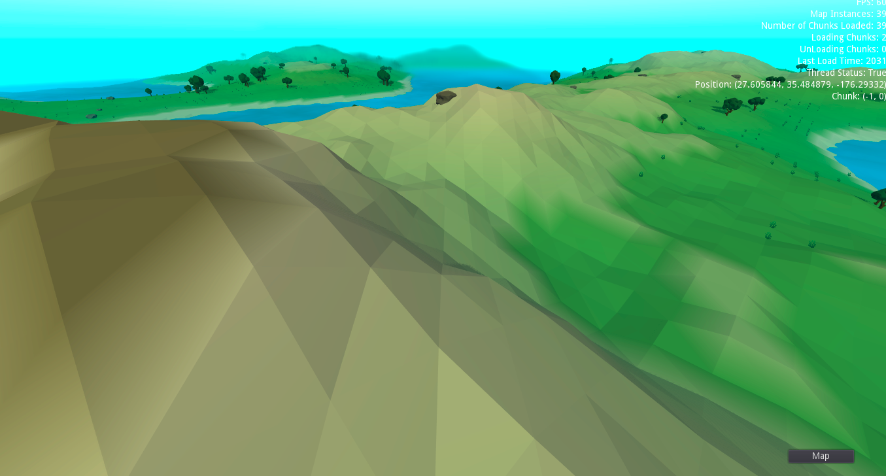
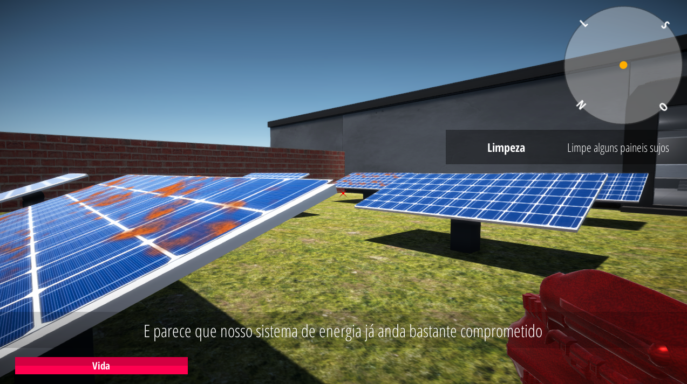
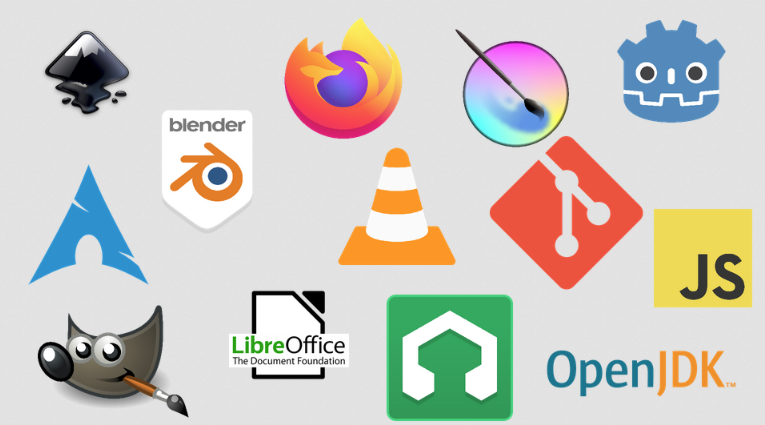

* Desenvolvimento Web
  * Node.js, Spring, REST
* Desenvolvimento de Jogos
  * Godot
* Software Livre

---

## Apresentação da Disciplina
### Ementa

Conceitos sobre aplicações WEB; Programação orientada a objetos; Arquitetura multicamadas; Introdução a Servidores de aplicação; HTTP, Requisições e Principais Protocolos; Aspectos básicos de segurança e escalabilidade; Linguagens e frameworks back-end; Persistência de dados; Construção e implementação de APIs; Estudo e implementação de novas tecnologias de WEB; Modelagem de soluções dinâmicas.

---

### Objetivo Geral

Identificar e qualificar a utilização de tecnologias e arquiteturas para desenvolvimento de serviços web

---

### Objetivos Específicos

* Caracterizar a estrutura e funcionamento de servidores web e seus protocolos;
* Identificar tecnologias utilizadas na construção de serviços web;
* Demonstrar a utilização de tecnologias usadas na transferência e armazenamento de dados;
* Desenvolver a autonomia na escolha e utilização de diferentes tecnologias web.

---

### Conteúdo Programático

* Arquitetura Web
* Ambiente de Desenvolvimento
* Controle de Versão
* Web Services e Frameworks
* Protocolo HTTP
* Arquitetura REST
* Integração com Banco de Dados
* Implantação de Software

---

<!--
paginate: true 
class: blank
-->

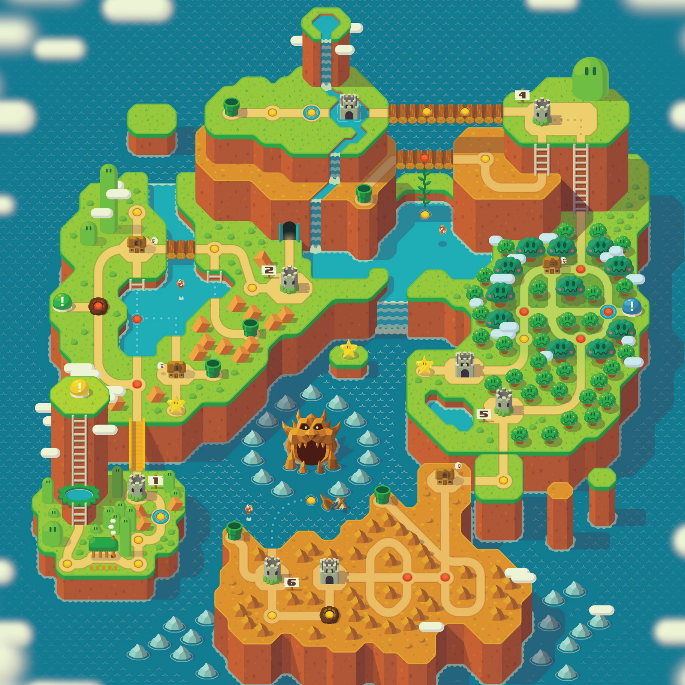

[Fonte](https://www.etsy.com/listing/1441199728/super-mario-world-map)

---

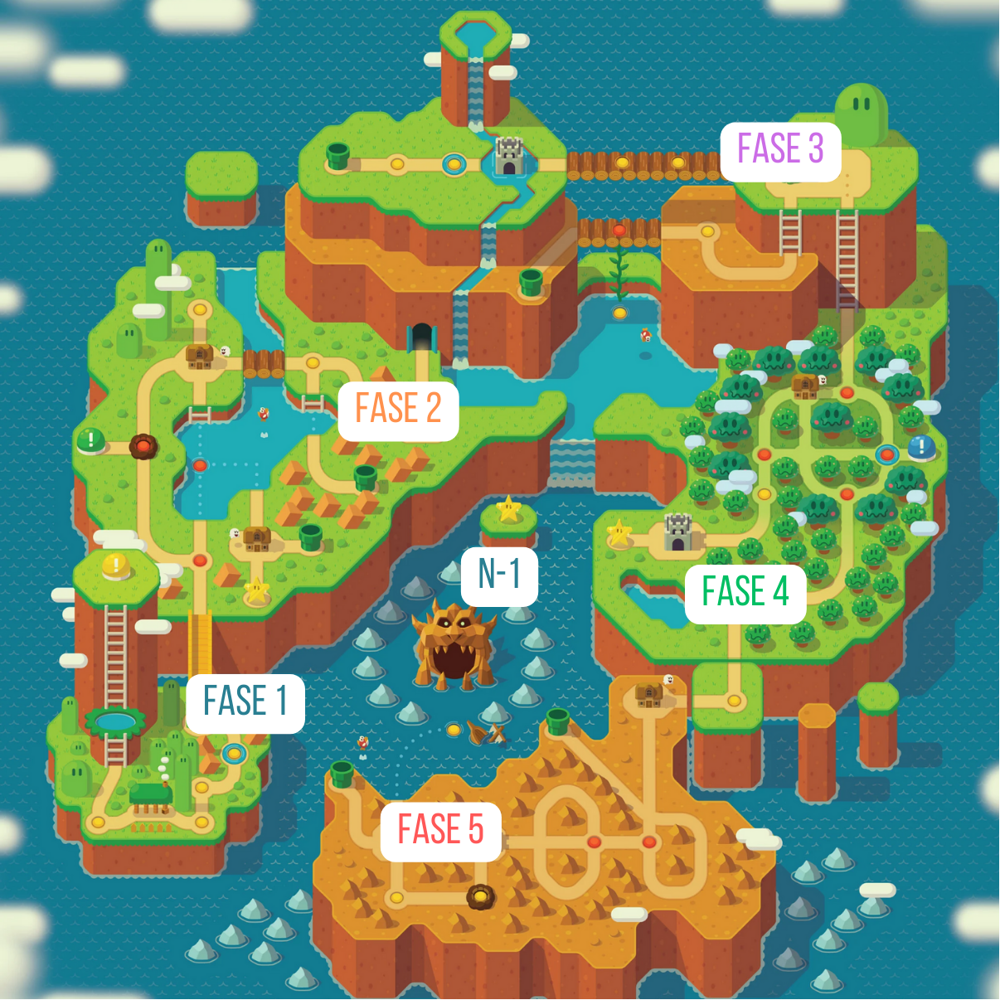

---

## Fase 1

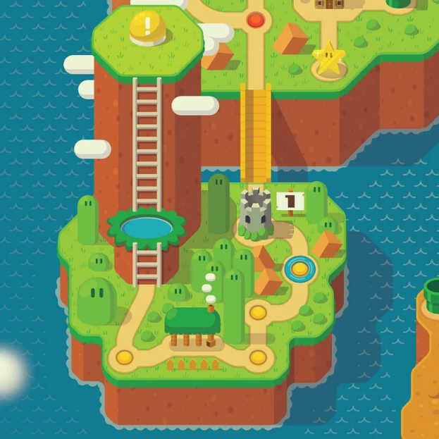

- História da Web
- Ambiente de Desenvolvimento
- Estruturas de Dados

---

## Fase 2

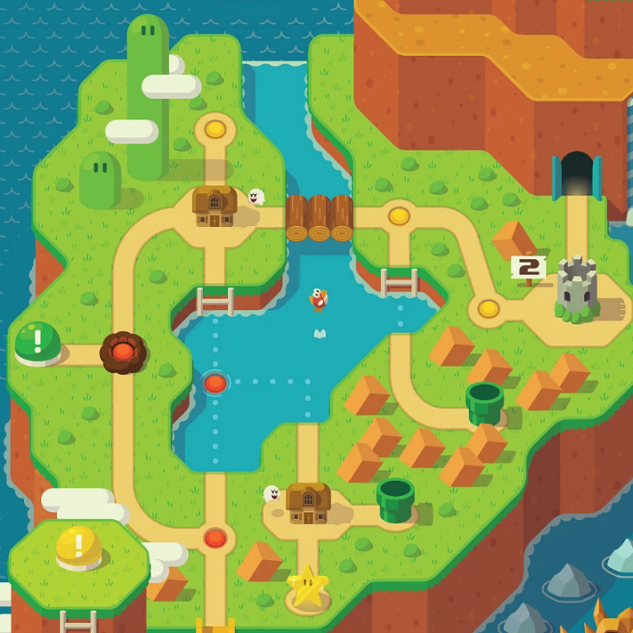

- Git e Gitlab
- JDK e JRE
- Orientação à Objeto com Java

---

## Fase 3

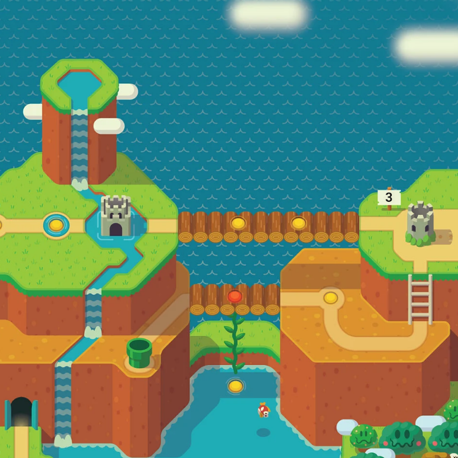

- Spring Web
- Protocolo HTTP
- Conteinerização com Docker
- **Projeto Intermediário (N2)**

---

## Fase 4

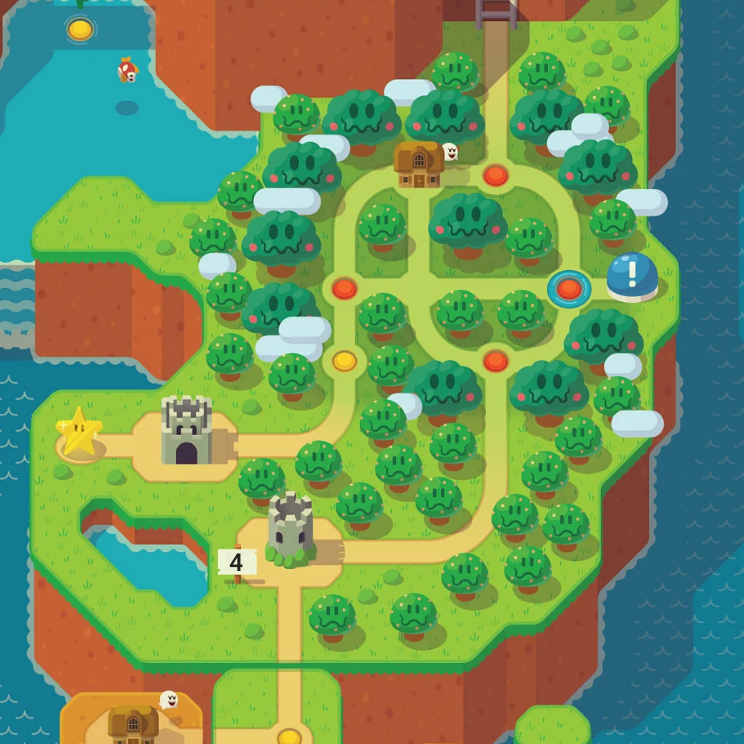

- Arquitetura REST
- Data Transfer Objects
- Mappers
- Repositórios

---

## Fase 5

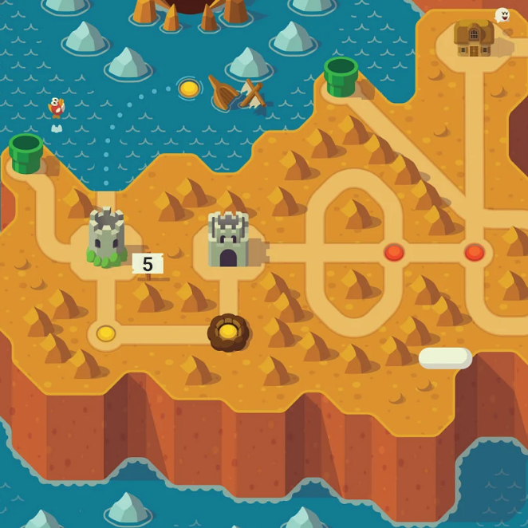

- Paginação e Validação
- Testes Unitários
- CICD
- Controle de Acesso
- Implantação em Servidor
- **Projeto Final (N3)**

---

## N-1

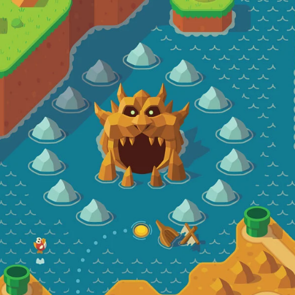

- Prova teórica e escrita
- Conteúdo de todo o semestre
- Evitar a reprovação

---

### Avaliações

* **N1**: Portifólio da Disciplina Individual (`finalizados / total * 10.0`)
* **N2**: Projeto Intermediário Individual (pequeno web service)
* **N3**: Projeto Final em Trios (CRUD API Restful)
* **N-1**: Avaliação Escrita Individual

#### Média Final

`(N1 + N2 + N3) / 3`

> A avaliação `N-1` possui caráter substitutivo em relação à avaliação de menor desempenho.

---

### Recursos

* Aulas expositivas;
* Live-coding;
* Práticas em sala de aula;
* Exercícios práticos semanais;
* Solução dos principais exercícios passo-a-passo;

---

### Repositório Oficial

https://gitlab.com/professor-rvenson/backend-2024-2

Todos os materiais de aula, incluindo avaliações, exercícios e exemplos de aula serão disponibilizados neste repositório oficial. O ambiente virtual poderá ser usado como repositório secundário em algumas situações.

---

### Contatos

* Email: ramon.venson@satc.edu.br
* Ambiente Virtual
* [Discord](https://discord.gg/ekRS3NuWSR) (informal)

---

### Outras considerações

* No máximo 20 faltas;
* Contato oficial apenas por email (ramon.venson@satc.edu.br);
* Horário de Aula: 18:50h às 22:00h;
* Registrar saídas antecipadas por email ou API;
* Entregas fora do prazo serão desconsideradas;
* Não deixar de realizar as atividades;
* Informe o professor prontamente sobre qualquer problema.