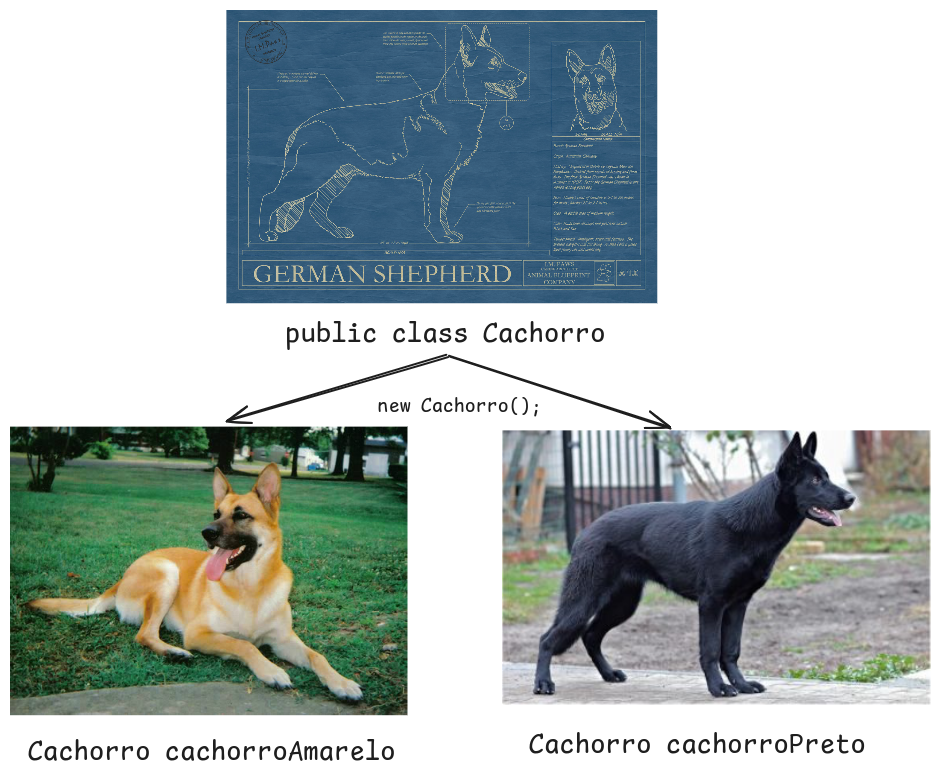
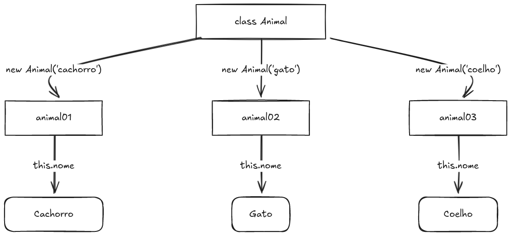

<!-- 
_class: lead
-->

# Aula 05 - Orientação à Objetos

---

<!--
paginate: true
class: normal
-->

## Orientação à Objeto


Orientação à Objeto (OOP - Oriented Object Programming) é um conceito de programação que tem como princípio abstrair o mundo real em objetos com dados e comportamentos.

---


Na Orientação à Objetos, todos os componentes de um sistema possuem **atributos** que o descrevem e **métodos** que descrevem funcionalidades.

Em uma analogia com o mundo real, podemos utilizar qualquer tipo de entidade (um cachorro por exemplo) e descrever seus atributos e funcionalidades

---


Um cachorro pode ser descrito (*atributos*) como:

* Cor
* Raça
* Tamanho
* Peso

---


E suas funcionalidades (*métodos*):

* Correr
* Dormir
* Comer
* Brincar

---


Além de objetos materiais ou pets, também podemos construir objetos a partir de modelos mais abstratos, como por exemplo um upload de vídeo.


---


Atributos:
* Título
* Usuário
* Curtidas
* Duração em Segundos
* Publicado

Funcionalidades:
* Exibir detalhes do vídeo
* Exibir comentário mais popular do vídeo
* Alterar o número de curtidas do vídeo

---

## Classes

O Java utiliza uma abordagem **orientada à objetos com suporte a classes**. Isso significa que os objetos criados usando java primeiro precisam ser declarados em forma de classe.

A **classe** representa um modelo de um **objeto**.

---



Usando a mesma analogia do cachorro do mundo real, uma **classe** é a estrutura que usamos pra descrever um cachorro.

Os diferentes cachorros existentes são os **objetos** criados a partir dessa estrutura.

---

Para criar uma classe utilizamos a seguinte sintaxe:

````java
public class Cachorro {
    public String nome;
    public String cor;

    public void latir() {
        System.out.println("HOUH!");
    }
    
}
````

Repare que dentro da declaração da classe estamos declarando diferentes variáveis (aqui chamadas de **atributos**) e funções (aqui chamadas de **métodos**).

---

### Criando um novo objeto a partir de uma classe

Com a classe criada, vamos utilizar a palavra `new` para criar um novo objeto. É necessário que o tipo de dados seja o mesmo nome da classe:

````java
public class Main {
    public static void main(String[] args) {
        Cachorro doguinho = new Cachorro();
        doguinho.nome = "Paçoca";
        doguinho.latir();
    }
}
````

A variável `doguinho` nesse caso será do tipo `Cachorro` e conterá todos os atributos e métodos descritos na classe.

---

## this


``this`` é um atributo especial de uma classe, que representa um objeto dentro dele mesmo.

Sua definição pode parecer confusa, mas na prática o `this` é utilizado para eliminar a confusão entre os atributos da classe e os parâmetros usados em seus métodos.

---



---

Quando usamos a palavra `this` dentro de um método, estamos referenciando o próprio objeto que estiver sendo manipulado no momento.

````java
public class Animal {
    public String nome;

    public void imprimeNome() {
      System.out.println("Meu nome é " + this.nome);
    }

}
````

---

No caso abaixo, o `this` é utilizado para diferenciar o atributo `nome` da classe do parâmetro `nome` do método `editaNome`, já que possuem a mesma grafia.

````java
public class Animal {
    public String nome;

    public void imprimeNome(String nome) {
        /*
        this.nome refere-se ao atributo da classe
        nome refere-se ao parâmetro da função
        */
        this.nome = "Animal: " + nome;
    }
}
````

---

## Herança

A herança permite à uma classe utilizar-se de todos os atributos e métodos de outra classe, funcionando como uma especialização da mesma.

````java
public class Funcionario {
    public String nome;
    public String codigo;

    public void baterPonto() {
        //
    }
}
public class Professor extends Funcionario {
    String disciplina;
}
````

---

Tudo o que foi definido para uma classe é automaticamente herdado para a classe que à extende.


````java
public class Main {
    public static void main(String[] args) {
        Professor ramon = new Professor();
        professor.nome = 'Ramon'
        professor.baterPonto();
    }
}
````

---

## Polimorfismo

Polimorfismo é a capacidade de criar funções com o mesmo nome usando diferentes assinaturas ou sobrescrevendo as assinaturas das classes herdadas. O Java permite implementar polimorfismo no código usando:

* Sobrecarga
* Sobreposição

---

### Sobrecarga

Polimorfismo por sobrecarga é a capacidade de criar métodos em uma mesma classe com diferentes parametros:

````java
public class Funcionario {
    public void baterPonto() {

    }

    public void baterPonto(int hora, int minuto) {

    }
}
````

---

### Sobreposição

Polimorfismo por sobreposição é a capacidade de re-criar métodos de uma classe heradada. Diferente da sobrecarga, o método sobreescrito deve manter os mesmo parâmetros do original.

````java
public class Professor extends Funcionario {
    @Override
    public void baterPonto() {
        System.out.println("Apenas em horário de aula");
    }
}
````

> O método sobreposto acompanha a anotação ``@Override``

---

## Encapsulamento

Encapsulamento é a capacidade de esconder atributos, métodos e classes para outras classes e packages.

````java
public class Funcionario {
    private String nome;
}

public class Main {
    public static void main(String[] args) {
        Funcionario ramon = new Funcionario();
        professor.nome = 'Ramon' // ERRO
    }
}
````

---

### Modificadores de Acesso

Modificadores de acesso tem como objetivo definir o nível de acesso de uma classe, atributo ou método a partir de outra classe.

Atributos ou métodos definidos como ``private`` **não podem ser acessados de fora do objeto**.

Atributos ou métodos definidos como ``protected`` **não podem ser acessados fora do mesmo package**.

Atributos ou métodos definidos como ``public`` **podem ser acessados de qualquer lugar**.

----

### GETTERS e SETTERS

É comum utilizar-se dos chamados Getters e Setters para acessar e modificar o valor de atributos privados.

````java
public class Funcionario {
    private String nome;

    public String getNome() {
        return nome;
    }

    public void setNome(String nome) {
        this.nome = nome;
    }
}
````

---


Os métodos get (getters) de um atributo geralmente inicial com a palavra ``get``.

Os métodos set (setters) de um atributo geralmente iniciam com a palavra ``set``.

Ambas as situações são apenas uma **convenção** bem conhecida na programação.

---

## Abstração

A abstração é a capacidade de reduzir detalhes de uma implementação de forma que o código possa atingir menor complexidade e maior reusabilidade. O Java possui duas formas principais de atingir abstração:

* Classes abstratas
* Interfaces

---

### Classes Abstratas

Uma classe abstrata **não pode ser instanciada**. Ela é utilizada apenas para ser herdada por outras classes.

````java
public abstract class BaseFuncionario {
  public String nome;
  public String codigo;
  public void baterPonto() {
    PontoEletronico.registrarPonto(Date.now(), codigo);
  };
}
````

É usada quando queremos criar uma classe base, definindo atributos e métodos que serão herdados por outras classes, sem permitir objetos instanciáveis.

---

#### Uso de Classes Abstratas

Ao usar a palavra `extends` para que nossa classe herde de uma classe abstrata, podemos herdar métodos e atributos da classe base.

````java
public class Professor extends BaseFuncionario {
  // Atributos nome e codigo são herdados
  // Método baterPonto já está implementado por herança
}
````

---

#### Métodos Abstratos

Também é possível definir métodos abstratos dentro de uma classe abstrata, definindo apenas sua assinatura (tipo, nome e parâmetros). Neste caso, será necessário que os herdeiros implementem o método em suas classes.

````java
public abstract class BaseFuncionario {
  public String nome;
  public String codigo;
  public abstract void baterPonto();
}
````

---

### Interfaces

Uma interface é uma classe abstrata que não possui atributos e métodos concretos. Todos os métodos definidos são, por padrão, abstratos e precisam ser implementados pelas classes que implementam essa interface.

````java
public interface Funcionario {
  public void baterPonto();
}
````

Geralmente é usada quando precisamos definir métodos comuns para classes que não possuem relação entre si.

---

#### Uso de Interfaces

Uma das vantagens do uso de interfaces é a possibilidade de implementar múltiplas interfaces em uma classe.

````java
public class Professor implements Funcionario, Desenvolvedor {
  public void baterPonto() {
    PontoEletronico.registrarPonto(Date.now());
  }
  public void desenvolver() {
    Codigo.escrever();
  }
}
````

---

## Comparativo entre Estruturas OOP

| Estrutura | `new` | Métodos | Atributos | Herança | Palavra |
| --- | --- | --- | --- | --- | --- |
| Classes Regulares | Sim | Sim | Sim | Sim | `class` |
| Classes Abstratas | Não | Sim | Sim | Sim | `abstract class` |
| Interfaces | Não | Sim | Não | Não | `interface`


---

## O que aprendemos hoje

* O que é orientação à objetos;
* Orientação à classe no java;
* Herança, poliforfismo e encapsulamento;
* Classes abstratas e Interfaces;