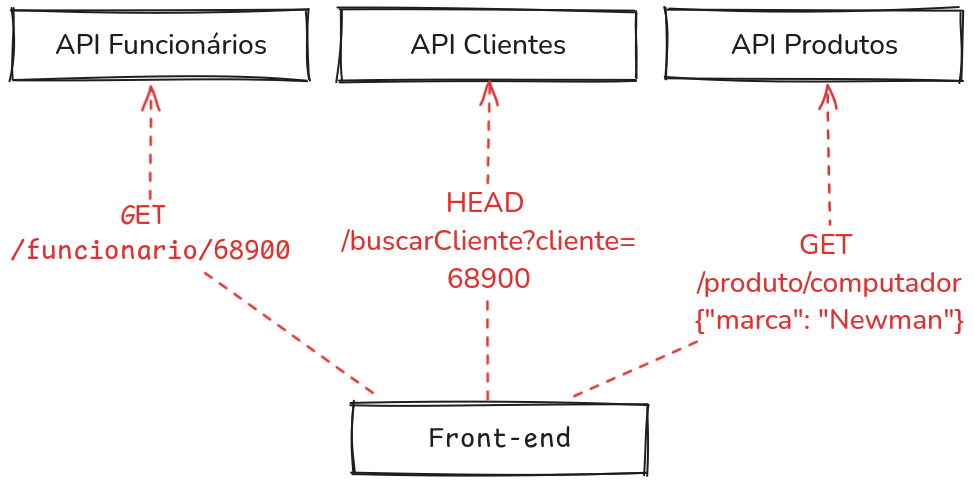
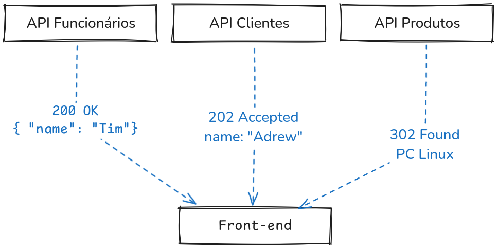

<!-- 
_class: lead
-->

# Aula 13 - REST

---

<!--
paginate: true
class: normal
-->

## Arquiteturas de Comunicação


A comunicação entre sistemas é um dos desafios para o desenvolvimento de aplicações para web.

Mesmo com um protocolo padronizado como o HTTP, ainda existe uma enorme complexidade em termos de comunicação entre sistemas.

---

### Exemplo de Arquitetura

Imagine que como Arquiteto de Sistemas você precisa integrar 3 sistemas diferentes com um *front-end*, cada um com sua própria API e equipe de desenvolvimento.

* Sistema A: API Funcionários
* Sistema B: API Clientes
* Sistema C: API Produtos
* Sistema D: Front-end

---



---



---

Como reduzir a complexidade de integração destes sistemas de forma que cada equipe possa trabalhar de maneira independente?

---

### Modelos

Nesse contexto, temos diferentes modelos de comunicação que se propõe a padronizar a comunicação usando como base o protocolo HTTP:

* REST
* SOAP
* GraphQL
* gRPC

---

### REST


``REST`` é um acrônimo para **Re**presentational **S**tate **T**ransfer. É uma arquitetura para sistemas de hipermidia distribuidas.

Em linhas gerais, a arquitetura REST compreende um sistema **padronizado** de gerenciamento de dados usando como base o protocolo HTTP.

---

### SOAP


SOAP é um protocolo de troca de mensagens estruturadas usando XML. Oferece suporte a transações mais complexas, porém é mais complexo de implementar e consumir.

---

### GraphQL


Protocolo mais flexível que o REST, com suporte à streaming de dados e que permite a criação de queries mais dinâmicas. Complexo quando usado para esquemas muito grandes.

---

### gRPC


Protocolo de comunicação entre aplicações, com suporte a streaming de dados e que permite a criação de queries mais dinâmicas. Mais complexo para tarefas simples.

---

## Analogia


Pense no protocolo HTTP como a língua a ser falada (ex.: Português) e o REST como uma formalização da língua (ex.: Português Brasileiro Formal) para reduzir o **ruído** na comunicação entre diferentes sistemas.

---

## Princípios REST


A arquitetura REST segue 6 princípios:

1. Cliente/Servidor
2. Stateless
3. Cacheable
4. Interface Uniforme
5. Sistema de Camadas
6. Código sob-demanda

---

### Cliente/Servidor


A separação de responsabilidades entre cliente e servidor permite a criação de aplicações mais flexíveis e escaláveis.

---

### Stateless


Uma requisição HTTP é independente de outras requisições HTTP. Isso garante escalabilidade na hora de distribuir a carga de trabalho da aplicação.

---

### Cacheable


Requisições HTTP podem ser armazenadas em cache para reduzir o tempo de resposta da aplicação. Para isso é necessário comunicar ao cliente quando uma requisição pode ser cacheada.

---

### Interface Uniforme


A arquitetura REST define um conjunto de regras para a criação de interfaces de comunicação entre sistemas. Esse conjunto de regras é o mesmo para qualquer tipo de aplicação, facilitando a criação de aplicações que se integram entre si.

---

### Sistema de Camadas


A arquitetura REST permite a criação de sistemas de camadas para acesso aos dados, garantindo escalabilidade dos dados da aplicação.

---

### Código sob-demanda


Código sob demanda é um conceito de programação que permite a criação de clientes que podem requisitar informações e extende-las sem a necessidade de alterar a arquitetura do servidor.

---

## URI - Unified Resource Identifier

A abstração chave na arquitetura REST é o ``resource`` (ou `URN`, recurso). Toda informação que pode ser nomeada pode ser um resource na implementação REST. Por exemplo:

* Usuário
* Foto
* Jogador de Futebol
* Pokémon
* Calendário

---

Um recurso pode ser identificado de maneira hierarquica. Dessa forma, nascem os identificadores chamados de URI (Unified Resource Identifier)

````
/usuarios
/usuarios/fotos
/time/jogador
/treinador
/treinador/pokemon/25
/calendario/2024/11/25
````

---

É importante destacar que o recurso representado não precisa ser necessariamente um mapeamento direto para uma tabela ou entidade da aplicação.

Por exemplo, um recurso **Agenda** pode ser mapeado para retornar os próximos compromissos de um usuário, porém os compromissos podem ser uma abstração de uma entidade **Aulas**, que representa as aulas de um semestre.

---

## URL vs URI


* URI: Identifica um recurso de maneira única (ex.: [/jogador](/jogador))
* URL: Descreve como um recurso pode ser localizado (ex.: https://venson.net.br/jogador)

---


---

## Verbos HTTP

Verbos HTTP são utilizados para adicionar semântica à uma requisição HTTP. Esses verbos auxiliam o servidor na identificação da natureza de uma requisição.

|Verbo|Request Body|Response Body|Safe|Descrição|
|---|---|---|---|---|
|GET|[Opcional](https://www.rfc-editor.org/rfc/rfc9110#section-9.3.1-6)|Sim|Sim|Recupera um recurso|
|POST|Sim|Sim|Não|Adiciona recurso|
|PUT|Sim|Sim|Não|Substitui recurso|
|PATCH|Sim|Sim|Não|Altera recurso|
|DELETE|Não|Sim|Não|Remove recurso|

---

|Verbo|Request Body|Response Body|Safe|Descrição|
|---|---|---|---|---|
|HEAD|Não|Não|Sim|Apenas cabeçalhos|
|CONNECT|Opcional|Sim|Não|Estabelece conexão|
|OPTIONS|Opcional|Sim|Sim|Opções de comunicacão|
|TRACE|Opcional|Sim|Não|Ping|

> Mais informações em [RFC 9110](https://www.rfc-editor.org/rfc/rfc9110#section-9.3.1-6)


---

## Códigos de Estado HTTP

Códigos de Estado HTTP representam uma abstração do resultado de uma resposta. Os códigos são divididos em números de 100 a 599:

* Códigos informativos (100-199);
* Códigos sucesso (200-299);
* Códigos redirecionamento (300-399);
* Códigos erros de cliente (400-499);
* Códigos erros de servidor (500-599);

> Mais informações em [Mozilla](https://developer.mozilla.org/pt-BR/docs/Web/HTTP/Status) ou [HTTP Cat](https://http.cat/)

---

## Padronização de Mensagens

**RESTful APIs** são construídas para fornecerem serviços à outras aplicações. Por isso é essencial que mensagens de sucesso e de erro sejam padronizadas. A estrutura do formato das mensagens deve ser sempre o mesmo, ainda que uma API possa responder com diferentes formatos. Os mais populares são:

* JSON
* XML
* YAML

---

## HATEOS


* Links de hipermídia para navegação

* Interação dinâmica permite que clientes descubram os caminhos da aplicação

* Acoplamento reduzido, permitindo modificações sem quebrar a navegação

---

## Mapeamento REST/HTTP

Para mapearmos a implementação de um CRUD (**C**reate, **R**ead, **U**pdate, **D**elete) usando a arquitetura REST, iremos utilizar os métodos descritos pelo protocolo HTTP como referência.

---

Para isso, usaremos:

* ``GET``, para consultar resources
* ``POST``, para adicionar resources
* ``PUT``, para atualizar resources
* ``DELETE``, para deletar resources

---

Adicionalmente, podemos utilizar:

* ``PATCH``, para atualizar partes de um resource
* ``PUT``, para adicionar resources

---

### GET

O método ``GET`` tem a finalidade de retornar dados em nossa API. Podemos consultar um conjunto de dados (por exemplo, uma collection). Não é necessário passar nada no corpo da mensagem.

Um método GET pode recuperar um único objeto ou uma coleção de objetos.

---

#### GET COLLECTION

`Requisição`
````js
GET /usuarios HTTP/1.1
````

`Resposta`
````js
200 OK HTTP/1.1
[
    { "_id": 1, "login": "prezi", "senha": "$2y$04$vouJ2Wnt4BTWt..."},
    { "_id": 2, "login": "delta", "senha": "$2y$10$V3ftrFJChSU62..."},
    { "_id": 3, "login": "alfa", "senha": "$2y$10$y0oGf5Ht3Kx43..."},
]
````

---

#### GET ONE

`Requisição`
````js
GET /usuarios/3 HTTP/1.1
````

`Resposta`
````js
200 OK HTTP/1.1
{ "id": 3, "login": "alfa"}
````

---

### POST

O método ``POST`` pode ser utilizado para inserir novos objetos em uma coleção. É necessário passar no corpo da mensagem o objeto completo a ser inserido. O retorno pode ser o próprio objeto enviado.

---

`Requisição`
````js
POST /usuarios HTTP/1.1
````

`Resposta`
````js
201 CREATED HTTP/1.1
{ "id": 4, "login": "bebeto", "senha": "$2y$10$q2Szl843MlxuO2jvS..."}
````

---

### PUT

O método ``PUT`` será utilizado para atualizar um recurso ou coleção. É necessário passar no corpo da mensagem um objeto completo a ser atualizado. O retorno, em caso de sucesso, pode ser o próprio objeto enviado.

Adicionalmente, o método `PUT` também pode ser utilizado para inserir novos objetos, dado que o recurso não exista inicialmente.

---

`Requisição`
````js
PUT /usuarios/4
{ "login": "kong", "senha": "$2y$10$oeiN2ObB3zdi/eZDWqy1bu6lOCK4CuMQ..."}
````

`Resposta`
````js
201 CREATED HTTP/1.1
{ "id": 4, "login": "kong"}
````

---

### DELETE

O método ``DELETE`` é utilizado para deletar recursos. Não é necessário passar nada no corpo. O retorno é geralmente, em caso de sucesso, vazio ou o próprio objeto deletado.

`Requisição`
````js
DELETE /usuarios/3
````

`Resposta`
````js
200 OK HTTP/1.1
{ "_id": 3, "login": "alfa" }
````

---

### PATCH

O método PATCH é utilizado para realizar alterações em um recurso, geralmente em parte dele. O retorno geralmente é o recurso atualizado.

---

`Requisição`
````js
PATCH /usuarios/4
{ "senha": "$2y$10$87bBf3XDDeecJ0b6O..." }
````

`Resposta`
````js
200 OK HTTP/1.1
{ "id": 4, "login": "kong"}
````

---

## Boas Práticas

Além de estar atento aos verbos HTTP e seus códigos de status, é importante seguir algumas boas práticas para a construção de APIs RESTful.

As boas práticas a seguir podem não estar expressamente definidas em nenhum RFC (Request for Comments), mas são amplamente aceitas e utilizadas.

---

### Gramática

Utilize substantivos para representar recursos e verbos para representar ações:

* *Document*: representa um objeto singular

````
http://localhost/gerenciamento
http://localhost/admin
````

* *Collection*: representa uma coleção de objetos gerenciada pelo servidor

````
http://localhost/usuarios
http://localhost/labs/07/computadores
````

---

* *Store*: representa uma coleção de objetos gerenciada pelo cliente

````
http://localhost/usuario/200/carrinho
http://localhost/usuario/200/playlist
````

* *Controller*: representa uma função adicional aplicada aos dados

````
http://localhost/hotel/200/check-in
http://localhost/temporada/01/start
````
----

### Hierarquias e Nomenclaturas
    
* Use a barra ``/`` para indicar relações de hierarquia
````
http://localhost/bancos/contas/400A
````
* Não use barras ``/`` ao final de um URI
````sh
http://localhost/usuarios/
http://localhost/usuarios # Melhor
````
* Use hífens ``-`` para melhorar a leitura de um URI
````sh
http://localhost/carrosDeAluguel
http://localhost/carros-de-aluguel # Melhor
````

---

* Evite o uso de traço baixo ``_``
````sh
http://localhost/carros_de_aluguel
http://localhost/carros-de-aluguel # Melhor
````
* Use letras minúsculas
````sh
http://localhost/Usuarios
http://localhost/usuarios # Melhor
````
* Não adicione extensão de arquivo
````sh
http://localhost/usuarios.json
http://localhost/usuarios # Melhor
````

---

### Parâmetros

* Use Query String para filtrar coleções
````sh
http://localhost/paises?continente=America
http://localhost/paises?continente=Africa&limite=5
````
* Nunca use o nome das funções CRUD na URI
````sh
http://localhost/usuarios/GET
http://localhost/usuarios/Adicionar
````

Estes URI podem ser utilizados para manipular os resources. Para isso, utilizamos os ``Resource Methods``, métodos associados ao protocolo HTTP que realizam operações sobre os dados da aplicação.

---

## O que aprendemos hoje

* O que é o modelo REST;
* Conceitos básicos do modelo
  * Recursos
  * URIs
  * Códigos HTTP
  * Verbos HTTP
* Boas práticas para implementar o modelo REST.