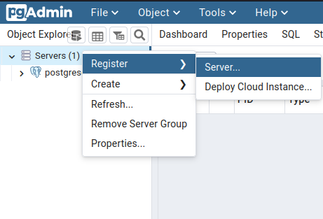
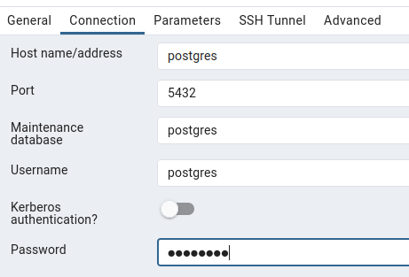
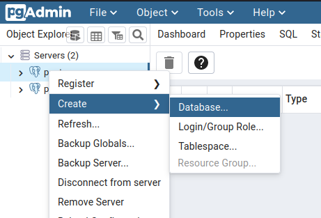
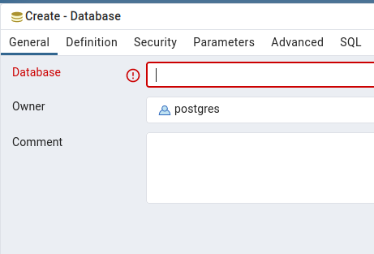

<!-- 
_class: lead
-->

# Extra 02 - Migrando para Postgres

---

<!--
paginate: true
class: normal
-->

## tl;dr

* Remover dependências do banco antigo (h2) no `pom.xml`;
* Adicionar dependências do novo banco (postgres) no `pom.xml`;
* Adicionar/alterar configurações no `application.properties`;
* Iniciar um banco postgres e interface de gerenciamento (`docker-compose`);
* Criar uma nova conexão na interface de gerenciamento;
* Criar uma nova base;

---

## Alterando dependências

Vamos iniciar removendo a dependência dos drivers do banco H2:

````xml
# remover
<dependency>
  <groupId>com.h2database</groupId>
  <artifactId>h2</artifactId>
  <scope>runtime</scope>
</dependency>
# remover
````

---

E adicionando as do banco Posgres:

````xml
<dependency>
  <groupId>org.postgresql</groupId>
  <artifactId>postgresql</artifactId>
  <scope>runtime</scope>
</dependency>
````

> Lembre-se de adicionar dentro da tag `<dependencies>`

---

## Configurações

Adicione configurações específicas do posgres no `application.properties` da sua aplicação:

````properties
spring.datasource.url=jdbc:postgresql://localhost:5432/animais
spring.datasource.username=postgres
spring.datasource.password=postgres
````

Observe que estamos especificando que a database terá o nome `animais`, que deverá ser criada posteriormente dentro do postgres.

---

## Docker compose

Crie um arquivo `docker-compose.yml` para especificar os serviços:

````yml
services:
  postgres:
    image: postgres
    environment:
      POSTGRES_PASSWORD: "postgres"
    ports:
      - "5432:5432"
    networks:
      - postgres-network
````

Repare que estamos criando uma rede específica para estes serviços.

> O arquivo continua...

---
````yml
  pgadmin:
    image: dpage/pgadmin4
    environment:
      PGADMIN_DEFAULT_EMAIL: "user@teste.com.br"
      PGADMIN_DEFAULT_PASSWORD: "postgres"
    ports:
      - "16543:80"
    depends_on:
      - postgres
    networks:
      - postgres-network

networks: 
  postgres-network:
````

Grave o nome de usuário para o gerenciador: `user@teste.com.br` e usuários e senha do banco: `postgres`

---

Na mesma pasta onde foi criado o arquivo, inicie o terminal e execute:

````
docker compose up
````

Se estiver usando uma versão mais antiga do docker, pode ser necessário usar a ferramenta plugin:

````
docker-compose up
````

---

## Interface de Gerenciamento

Acesse a interface de gerenciamento digitando `http://localhost:16543/` no navegador.

* Usuário: `user@teste.com.br`
* Senha: `123456`

Se a senha não funcionar, pode ser devido ao fato de ter sido configurada com outro usuário anteriormente. Derrube o serviço do docker, delete o volume desse serviço e reinicie.

````
docker-compose down -v
docker compose down -v
````

---

## Criando uma conexão




Clique com a direita em `Servers` e registre um novo servidor. Com a inteface criado no docker, os serviços podem se localizar pelo seu nome de serviço, nesse caso, utilize `postgres` no hostname (e também no usuário e senha).

---

## Criando uma database




Para criar uma nova base de dados, apenas clique com a direita no servidor criado (abaixo de `Servers`) e crie uma database com o nome desejado (`animais` para o exemplo).