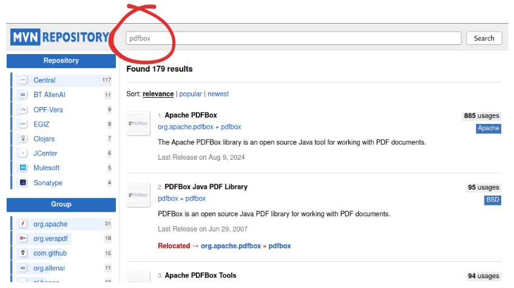
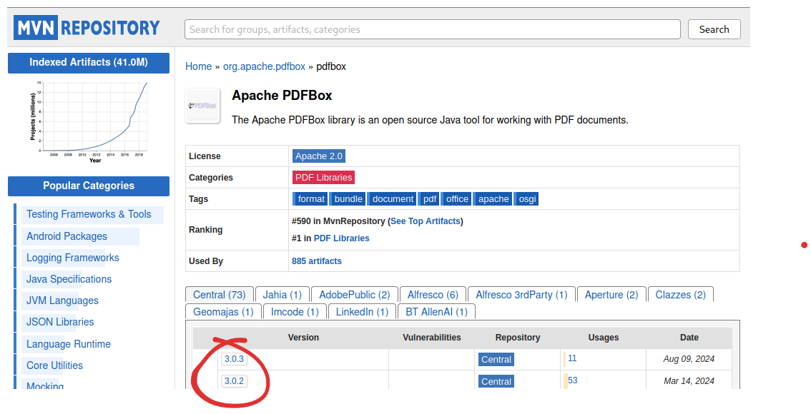
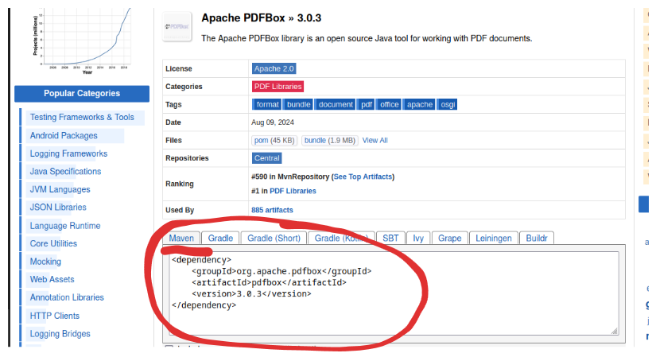

<!-- 
_class: lead
-->

# Extra 03 - Gerenciamento de Dependências

---

## Dependências

* Dependências são objetos que uma classe precisa para funcionar;
* Podem ser de qualquer tipo, desde objetos simples até objetos complexos;
* Uma dependência pode ser a nível de projeto ou de classe;

---

### Cenários de Dependências

Alguns cenários onde dependências são usadas:

* Logging (ex.: log4j)
* Manipulação de tipos de arquivo (ex.: xml, json, csv, pdf...)
* Banco de dados (ex.: JPA, Hibernate)
* Teste (ex.: JUnit, Mockito)
* Frameworks (ex.: Spring, Hibernate)
* Comunicação com outras aplicações

---

## Maven

* Ferramenta de gerenciamento de dependências e compilação;
* Organiza as dependências de um projeto;
* Atualiza automaticamente as dependências;
* Gerencia a versão das dependências;

---

### POM.XML

* Arquivo de configuração do Maven;
* Define o projeto, suas dependências e configurações;
* Define o nome, versão, dependências, plugins, etc;

---

```xml
<?xml version="1.0" encoding="UTF-8"?>
<project xmlns="http://maven.apache.org/POM/4.0.0"
         xmlns:xsi="http://www.w3.org/2001/XMLSchema-instance"
         xsi:schemaLocation="http://maven.apache.org/POM/4.0.0">
    <modelVersion>4.0.0</modelVersion>

    <groupId>br.net.venson</groupId>
    <artifactId>exercicio02</artifactId>
    <version>1.0-SNAPSHOT</version>

    <properties>
        <maven.compiler.source>17</maven.compiler.source>
        <maven.compiler.target>17</maven.compiler.target>
    </properties>
</project>
```

---

#### Tags do POM.XML

* `<project>`: Define o projeto;
* `<groupId>`: Define identificador do grupo do projeto (ex.: `br.net.venson`);
* `<artifactId>`: Define o identificador do projeto;
* `<version>`: Define a versão do projeto;
* `<properties>`: Define as configurações do projeto (ex.: versão do Java);
* `<plugins>`: Define os plugins do Maven (ex.: compilador, testes, etc);
* `<dependencies>`: Define um conjunto dependências do projeto;
    * `<dependency>`: Define uma dependência do projeto (ex.: Spring, PDFBox, GSON, etc);

---

### Maven Repository

* Indexador de dependências;
* Contém uma lista de repositórios e dependências;

[Maven Repository](https://mvnrepository.com/)

---

## Adicionando o PDFBox

Vamos usar como exemplo a biblioteca PDFBox para manipular arquivos PDF;

* Pesquise o repositório do PDFBox no Maven Repository;
* Copie o código do POM.XML;
* Adicione a dependência no POM.XML;
* Atualize pela IDE ou execute o Maven Update;

---



---



---



---

Adicione o XML da dependência no POM.XML, dentro de `<dependencies>`:

```
<dependency>
    <groupId>org.apache.pdfbox</groupId>
    <artifactId>pdfbox</artifactId>
    <version>3.0.3</version>
</dependency>
```

---

Atualize o POM.XML e execute o Maven Update:

```sh
mvn clean install
```

---

## O que aprendemos hoje

* O que são dependências;
* O que é o Maven;
* Maven Repository;