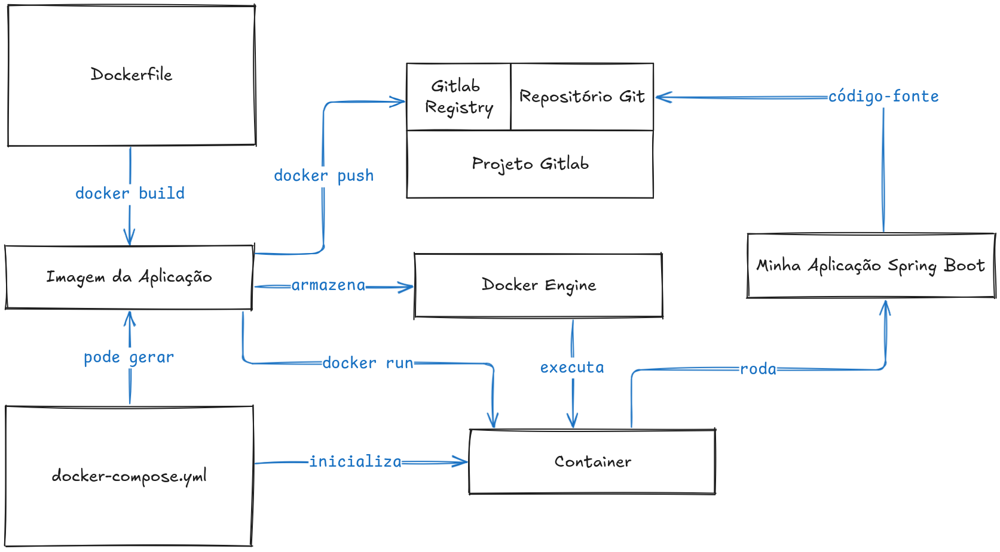

<!-- 
_class: lead
-->

# Extra 05 - Docker Engine

---

## Docker Engine


O Docker é uma plataforma de código aberto que permite criar, implantar e executar aplicativos em contêineres. Os contêineres são pacotes leves que contêm tudo o que um aplicativo precisa para funcionar, incluindo código, bibliotecas, ferramentas e configurações.

---

## Imagens


As imagens são como modelos para criar contêineres. Elas contêm tudo o que é necessário para executar um aplicativo, incluindo o sistema operacional, bibliotecas, ferramentas e código.

---

## Containers


Os contêineres são instâncias individuais de imagens. Eles são criados a partir de imagens e podem ser executados em qualquer ambiente que tenha o Docker instalado.

---

## Container vs Máquina Virtual


Enquanto uma máquina virtual é uma cópia completa de um computador, um contêiner é uma cópia leve de um conjunto de aplicativos.

---



---


---

## Gerando uma Imagem

Para gerar uma imagem, você precisa de um arquivo chamado Dockerfile. Esse arquivo contém instruções sobre como criar a imagem.

Também é necessário ter o Docker instalado em sua máquina.

---

### Dockerfile

O script abaixo será responsável por gerar um pacote distribuível de uma aplicação Spring Boot:

````dockerfile
FROM openjdk:23-jdk-oracle
EXPOSE 8080
WORKDIR /app
COPY . /app
CMD ["./mvnw", "spring-boot:run"]
````

---

* `FROM`: Especifica a imagem base que será usada para criar a imagem. Sempre é necessário uma imagem base para criar outra imagem.
* `WORKDIR`: Define o diretório de trabalho dentro do contêiner.
* `COPY`: Copia os arquivos do diretório local para o diretório de trabalho no contêiner.
* `RUN`: Executa um comando no contêiner.

---

### Build da Imagem

Para criar uma imagem a partir do Dockerfile, você pode usar o seguinte comando no terminal:

````bash
docker build -t nome_da_imagem .
````

> Não esqueça do ponto no final do comando, que representa a pasta atual. Você deve estar dentro da pasta do Dockerfile para executar o comando.

---

### Conferindo a imagem criada

Para verificar se a imagem foi criada com sucesso, você pode usar o seguinte comando no terminal:

````bash
docker images ls
````

---

### Executando um Container

Para executar um contêiner a partir de uma imagem, você pode usar o seguinte comando no terminal:

````bash
docker run -p 8080:8080 nome_da_imagem
````

> Utilize Ctrl + C para parar o container.

---

### Executando um Container em Segundo Plano

Se você deseja executar um contêiner em segundo plano, você pode adicionar o `-d` no comando:

````bash
docker run -p 8080:8080 -d nome_da_imagem
````

Nesse caso, você vai precisar parar o comando usando o comando `docker stop <nome_do_container>` onde `<nome_do_container>` é o nome do container que você deseja parar.

````bash
docker container ls
````
---

### Removendo Imagens

Para remover uma imagem, você pode usar o seguinte comando no terminal:

````bash
docker image rm nome_da_imagem
````

---

## Multi-Stage Build

Uma forma de otimizar o processo de construção de imagens é usando o Multi-Stage Build. Esse método permite que você construa uma imagem com base em uma imagem de base e, em seguida, copie os artefatos necessários para uma imagem de produção.

---

Altere o `Dockerfile` anterior para:

````dockerfile
FROM maven:3.9-eclipse-temurin-22-alpine as build
WORKDIR /app
COPY . /app
RUN mvn clean package -DskipTests

FROM openjdk:22-oracle
COPY --from=build /app/target/*.jar app.jar
EXPOSE 8080
ENTRYPOINT ["java", "-jar", "/app.jar"]
````

Este script agora usa duas imagens: uma imagem de build e uma imagem de produção. A imagem de build é usada para construir o aplicativo e a imagem de produção é usada para executar o aplicativo.

---

## Docker Compose

Para facilitar a execução de contêineres, o Docker oferece o Docker Compose. O Docker Compose é um utilitário que permite definir e executar aplicativos multi-contêiner usando um arquivo YAML.

---

### Executando um container com Docker Compose

````yaml
services:
  spring-app:
    build: .
    container_name: spring-app
    ports:
      - "8080:8080"
    networks:
      - spring-network
networks:
  spring-network:
    driver: bridge
````

Nesse caso estamos especificando que a imagem será construída a partir do Dockerfile atual. A porta usada pelo container será a 8080 e o nome do container será `spring-app`. Além disso criamos uma rede chamada `spring-network` que será usada para conectar o container ao host.

---

## Fazendo upload de imagens para o Gitlab

Ao criar um projeto no Gitlab, é possível fazer upload de imagens para o Gitlab Registry.

Primeiro é necessário realizar o login no Gitlab Registry usando o terminal:

````bash
docker login registry.gitlab.com
````

---

Em seguida, vamos realizar uma build específica da aplicação, usando diretamente o `docker build`:

````bash
docker build -t registry.gitlab.com/seu-usuario/seu-projeto/imagem:1.0.0 .
````

Por fim, vamos fazer o push da imagem para o Gitlab Registry:

````bash
docker push registry.gitlab.com/seu-usuario/seu-projeto/imagem:1.0.0
````

---

## O que aprendemos hoje

* O que são contêineres e imagens
* Como criar uma imagem
* Como executar um contêiner
* Como executar containers usando o Docker Compose
* Como fazer upload de imagens para o Gitlab